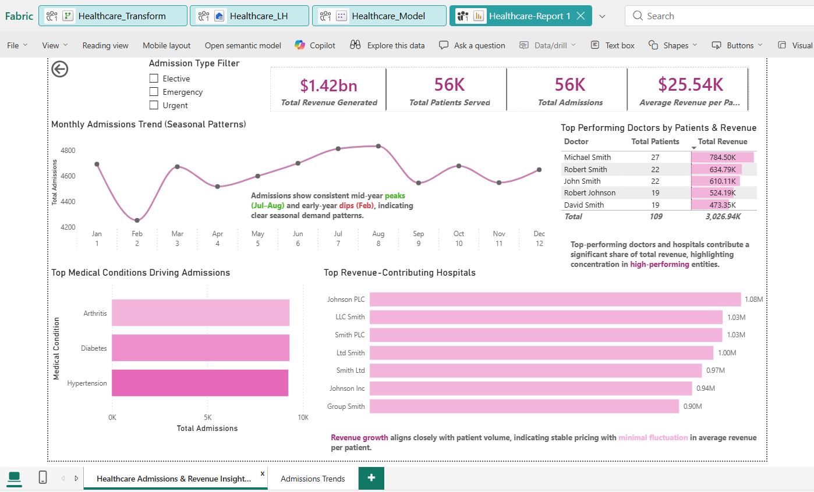
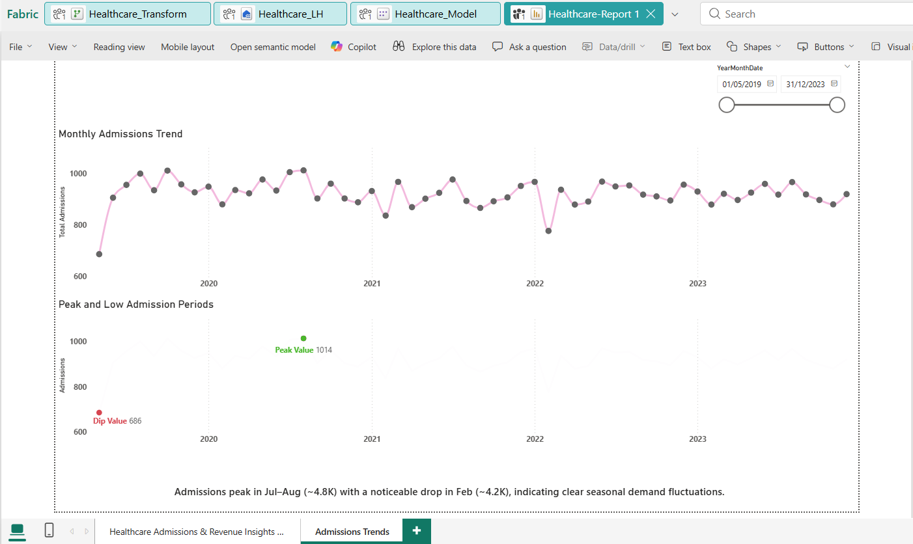
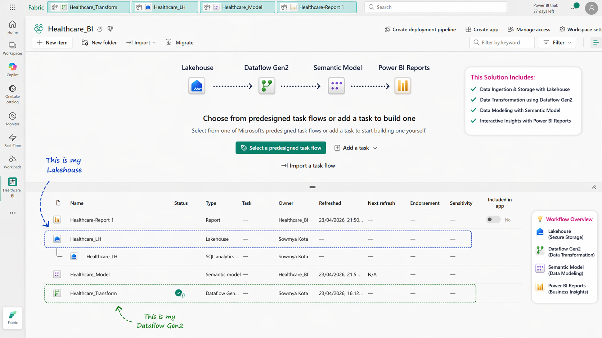

# 📊 Healthcare Admissions & Revenue Analytics
📌 End-to-End Data Analytics Project | SQL • Power BI • Microsoft Fabric

## ❓ Problem Statement
This project addresses these challenges by building an end-to-end analytics solution that enables data-driven decision-making.
However, raw data across multiple sources makes it difficult to:
- Track revenue performance
- Identify seasonal admission trends
- Analyze hospital and doctor performance
  
This project solves these challenges by building an end-to-end analytics solution.

## 🚀 Project Overview
This project demonstrates an end-to-end analytics solution built using Microsoft Fabric, SQL, and Power BI to analyze healthcare admissions, revenue trends, and operational performance.

The goal is to transform raw healthcare data into actionable business insights for better decision-making.

---

## 🛠️ Tech Stack
- Microsoft Fabric (Dataflows Gen2, Lakehouse)
- SQL (Data Extraction & Transformation)
- Power BI (Dashboard & Visualization)
- DAX (KPI Calculations & Time Intelligence)

---

## 📂 Data Pipeline
1. Data ingestion using Fabric Dataflows  
2. Storage in Lakehouse  
3. Data transformation & cleaning  
4. Star schema data modeling  
5. Semantic model creation  
6. Visualization using Power BI  

---

## 📊 Key Metrics
- Total Revenue Generated
- Total Admissions
- Average Revenue per Patient
- Length of Stay
- Admission Trends (Monthly/Yearly)

---

## 📈 Key Features
- Revenue and admissions trend analysis  
- KPI tracking (growth, variance, performance)  
- Time-based analysis using DAX  
- Interactive dashboards with drill-down capability  
- Optimized data model for performance  

---

## 💡 Business Insights
- Identified peak admission periods and revenue-driving segments  
- Highlighted trends impacting hospital performance  
- Enabled data-driven decision-making  

---

## 🧭 How to Use Dashboard
- Filter by Admission Type (Emergency, Elective, Urgent)
- Explore trends using date slicer
- Drill down by hospital, doctor, and patient segments

---

## 🗄️ Sample SQL Queries

```sql
-- Revenue by Month
SELECT 
    Month,
    SUM(Billing_Amount) AS Total_Revenue
FROM fact_admissions
GROUP BY Month
ORDER BY Month;
```

## 📌 Key Learnings
- Built scalable data models using star schema  
- Implemented end-to-end analytics workflows in Microsoft Fabric  
- Developed efficient DAX measures for business KPIs  
- Translated raw data into actionable insights  

---

## 📸 Dashboard Preview

### 🧩 Data Model (Star Schema)


### 📊 Business Overview Dashboard


### 📈 Trend Analysis


### ⚙️ Data Pipeline (Microsoft Fabric)


---

## 📁 Project Structure
- /data → dataset (or sample)
- /images → dashboard screenshots
- /sql → SQL queries
- /pbix → Power BI file

---
